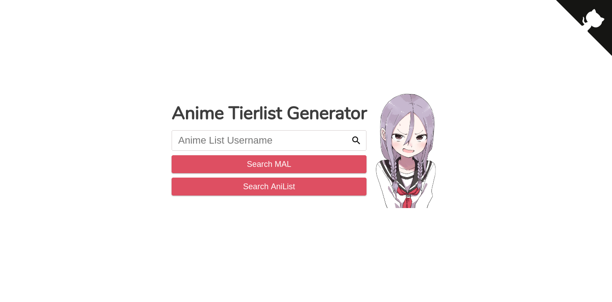
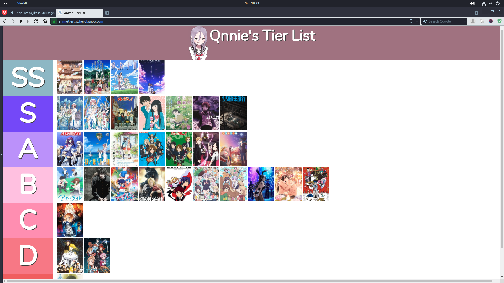

NOTE
------------------------------
Manga only works for MAL atm

About
------------------------------
Just a fun little project that converts your MAL and or AniList to a tier list. Feel free to improve any aspect and send in a pull
request <3

Customize (For MAL Only)
------------------------------
Put the following inside your bio.   
Heres my profile as an example https://myanimelist.net/profile/Qnnie  
Background Image: {{image url}}
 
Your top bar can be different colors. 
 
Colors can be Hex ex: [[#ffffff]] 
 
RGB: [[rgb(255,0,0)]] 
 
or even slightly transparent with RGBA [[rgba(255,0,0,0.5)]] 
 
Normal ex: [[green]] 
 
CUSTOM RANKS 
ex: <<SS,S,A,B,C,D,F,F,F,F>>
*SS = 10
*S = 9
*A = 8
*B = 7
*C = 6
*D = 5
*F = 4-1

Tips
------------------------------
<ul>
    <li>You can actually take a screenshot of your list by using browser extensions.</li>
    <li>If you're only getting a section like "Plan to watch" You need to go to your list settings and remove that as your default</li>
</ul>

How to run locally
------------------------------
<ol>
  <li>open up command line tool for the following commands</li>
  <li>git clone https://github.com/Qnnie/AnimeTierList</li>
  <li>cd AnimeTierList</li>
  <li>npm install</li>
  <li>node src/app.js</li>
</ol>

